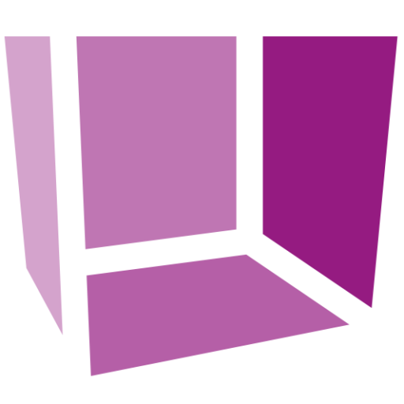
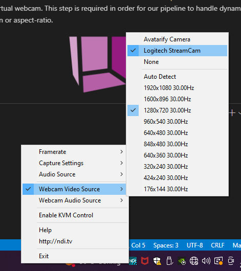
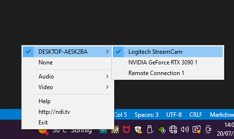
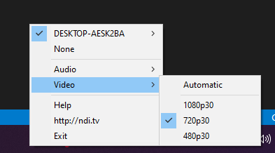
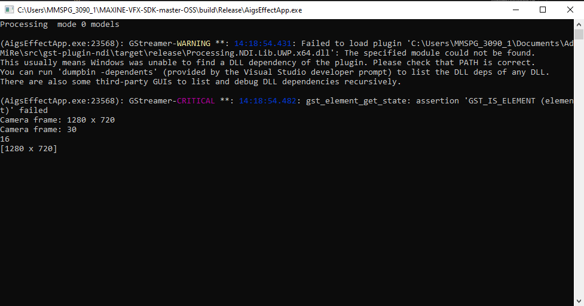
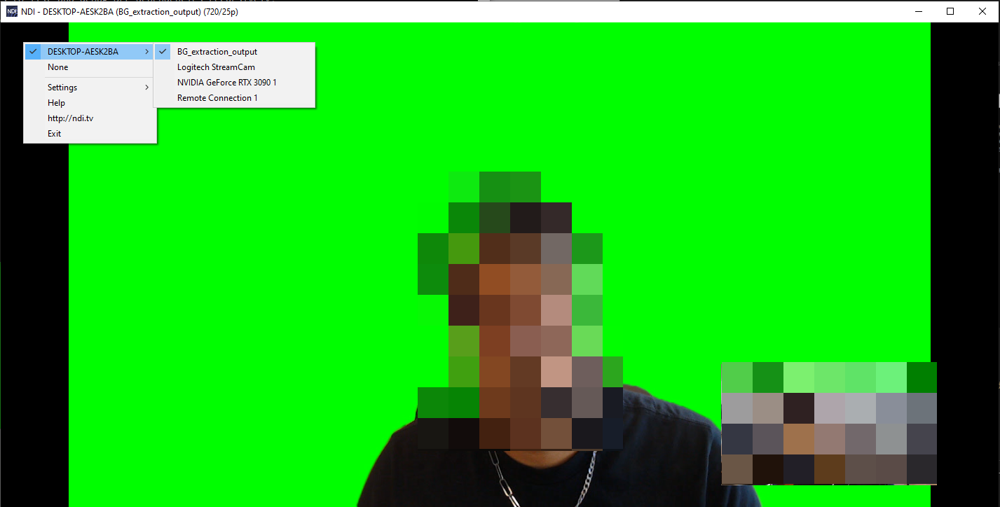

# AdMiRe EPFL

<p align="center">
  
</p>

Currently, TV audiences can only interact with the shows they are watching through social media or hybrid broadcast broadband TV. Additionally, content creators in film, TV or live productions face technical challenges that result in less engaging content. The EU-funded AdMiRe project aims to tackle both these problems by developing, validating and demonstrating innovative solutions based on mixed reality technology. These solutions will enable audiences at home to be incorporated into the live TV programme they are watching and to interact with people in the TV studio. They will also provide content creators with tools that radically improve talent immersion and interaction with computer-generated elements.

- [Website](http://www.admire3d.eu/contact-press/)
- [Facebook]()
- [Twitter](https://twitter.com/AdRe3d)
- [Youtube](https://www.youtube.com/channel/UCYkglsCm9-Q_8NNHsg1UCAg)
- [Linkedin](https://www.linkedin.com/company/admire-project/?viewAsMember=true)

This repository contains the result of EPFL's contribution to the project, i.e the Background Extraction and Super Resolution modules, with input and output as NDI streams.

Table of contents
=================

<!--ts-->
   * [Requirements](#requirements)
   * [Installation](#installation)
   * [Usage](#usage)
      * [PowerShell pipelines](#powershell-pipelines)
      * [HTTP Server and Client](#http-server-and-client)
   * [Licenses](#licenses)
   * [Acknowledgement](#acknowledgement)
   * [Collaborators](#collaborators)
<!--te-->

# Requirements

Operating System: Windows 10 64-bit

Graphics card: NVIDIA® GeForce RTX® 20XX and 30XX Series, Quadro RTX™ 3000, TITAN RTX™, or higher (any NVIDIA GPUs with Tensor Cores)

# Installation

### 1. Visual Studio 2017
Download Visual Studio 2017 [here](https://my.visualstudio.com/Downloads?q=visual%20studio%202017&wt.mc_id=o~msft~vscom~older-downloads) (it might ask you to connect with your Microsoft account).

Desktop development with C++ is the only required checkbox [x]

### 2. NVIDIA Maxine Video Effects SDK
Install the requirements:
- [NVIDIA Display Driver 465.89 or more recent](http://www.nvidia.com/Download/index.aspx?lang=en-us)
- [CMake 3.12+](https://cmake.org/download/)

Download the NVIDIA Maxine Video Effects SDK [here](https://developer.nvidia.com/maxine-getting-started)

Follow the instructions on [NVIDIA Maxine Video Effects' documentation](https://docs.nvidia.com/deeplearning/maxine/vfx-sdk-system-guide/index.html)

Don't forget to:
- Rename the folder ```MAXINE-VFX-SDK-master-OSS``` and move it to ```C:/Users/[username]/```
- Install the [SDK installer](https://www.nvidia.com/broadcast-sdk-resources) (this was specified in their [github repository](https://github.com/NVIDIA/MAXINE-VFX-SDK))
- **[CMake]** click "Configure", check the "Install SDK" box, click "Generate" and select:
  1. Visual Studio 2017
  2. x64
- **[Visual Studio 2017]** Make sure that you are building the Release version (and not the Debug one)
- **[Visual Studio 2017 - if needed]** Wait for the error containing the link and add the h264 dll file to the ```Release``` folder, alongside the executables

**[WARNING]** You cannot build anything until you have finished the installation of OpenCV (see below). So leave this window open and continue the installation process. We explain everything in the last section, **7. Final Steps**.

### 3. Python and dependencies
1. Install [Miniconda](https://docs.conda.io/en/latest/miniconda.html)
2. Run ```conda init``` in the terminal, close the terminal and reopen it to take the changes into account
3. Run ```conda install pytorch==1.11.0 torchvision==0.12.0 torchaudio==0.11.0 cudatoolkit=11.3 -c pytorch``` to install a compatible version of pytorch
4. Run ```pip install -r requirements.txt``` to install the required dependencies

### 4. GStreamer
1. [Download](https://gstreamer.freedesktop.org/documentation/installing/on-windows.html?gi-language=c) and run __both__ the runtime and the development installers, and select __complete__ installation for both
2. Add the bin and the lib folders (inside the GStreamer folder) to the PATH
3. Add an enviroment variable called `GSTREAMER_DIR` with the path to GStreamer (usually `C:/gstreamer` or `D:/gstreamer`)

Run the following command to make sure that GStreamer works properly:

```
gst-launch-1.0 -v videotestsrc ! autovideosink
```

### 5. NDI plugin for GStreamer

1. Clone [gst-plugin-ndi](https://github.com/teltek/gst-plugin-ndi) inside `C:/Users/[username]` for example
2. Download and install Rust from [here](https://www.rust-lang.org/tools/install)
3. If not already installed, install the regular (not advanced) [NDI sdk](https://downloads.ndi.tv/SDK/NDI_SDK/NDI%205%20SDK.exe)
4. Copy .dll and .lib files from Bin and Lib folder of the NDI sdk installation path to gst-plugin-ndi folder
5. Run ```cargo build --release``` from the git repository folder (`C:/Users/[username]/gst-plugin-ndi/` for example)
6. Move the NDI SDK .dll and .lib files from `C:/Program Files/NDI/NDI 5 SDK/Bin` and `C:/Program Files/NDI/NDI 5 SDK/Lib` to `.../gst-plugin-ndi/target/release`
7. Add the release folder to the PATH
8. Add the release folder as an environment variable called ```GST_PLUGIN_PATH```
9. Run ```gst-inspect-1.0.exe ndisrc```, ```gst-inspect-1.0.exe ndisink``` and ```gst-inspect-1.0.exe ndi``` to make sure the plugin was correctly installed. These commands should output details about the GStreamer elements.

### 6. OpenCV 3.4.6
1. Download the [source code for OpenCV 3.4.6](https://github.com/opencv/opencv/archive/3.4.6.zip), unzip it, and put it inside `C:/Users/[username]` for example
2. Run CMake, specify the path to the OpenCV folder as the source, the build folder as the output, and click Configure
3. Check that GStreamer is found (there should be a list of paths appearing next to GStreamer elements), and that the WITH_GSTREAMER box is ticked
4. Tick the OPENCV_PYTHON3_VERSION box
5. Tick the BUILD_opencv_world box
6. Click Generate
7. Open the solution file located in the build folder
8. Make sure that Release is selected on top (not Debug)
9. Rebuild (and wait, this can take from several minutes to 1 hour depending on your computer)

### 7. Final steps

1. Run ```git clone https://github.com/mmspg/AdMiRe_EPFL.git``` in the folder of your choice

2. Open the Visual Studio 2017 solution file from the NVIDIA MAxine Video Effects SDK Release folder

3. Remove the `AigsEffectApp.cpp` from the `AigsEffectApp/Source Files` folder in Visual Studio 2017 (right menu)

4. Remove the `VideoEffectsApp.cpp` from the `VideoEffectsApp/Source Files` folder in Visual Studio 2017 (right menu)

5. Copy the `AigsEffectApp.cpp` and `VideoEffectsApp.cpp` files located in the NVIDIA_Maxine_modules folder of this repository to the `AigsEffectApp/Source Files` and `VideoEffectsApp/Source Files` directories respectively, in Visual Studio 2017 (right menu). This will link the .cpp files of this repo to the Visual Studio 2017 solution project.

6. Right-click on AigsEffectApp and Rebuild

7. Right-click on VideoEffectsApp and Rebuild

8. Install NDI Tools [here](https://downloads.ndi.tv/Tools/NDI%205%20Tools.exe)

### General installation advices:
- [CMake] Make sure to delete the cache and/or delete the build folder before configurating if needed.

# Usage
Once you have installed everything, you should be able to run our pipelines.

First, make sure that you have an NDI stream to provide as input. If you need to create one, you can simply use the **Screen Capture** application shipped with NDI Tools. To do so, open the application, *right-click* on its icon in the taskbar and select `Webcam Video Source` > `[YOUR VIDEO INPUT]`.

<p align="center">
  
</p>

You can check that your computer indeed receives the NDI stream of interest with the **Studio Monitor** application shipped with NDI Tools.

Once you made sure that you are receiving an NDI stream, open the **Webcam Input** application shipped with NDI Tools, *right-click* on its icon in the taskbar and select `[YOUR COMPUTER NAME]` > `[YOUR NDI STREAM]`. Also, *right-click* on its icon in the taskbar and select `Video` > `720p30`. This will turn the stream into a 720p/30fps virtual webcam. This step is required in order for our pipeline to handle dynamic changes in resolution or aspect-ratio.

<p align="center">
  
</p>

<p align="center">
  
</p>

## Powershell pipelines
The PowerShell pipelines are located in `src/powershell_pipelines`.

- With default parameters (see below): 
   - *right-click* on the selected pipeline - `Run with PowerShell`
- With non-default parameters:
   - Open a Windows PowerShell window
   - Navigate to the `powershell_pipelines` folder
   - Run the PowerShell script with the desired parameters (see below). 
   - Example: ```.\pipeline_nvidiaMaxineBE.ps1 -index_val=1 -comp_mode=7```

After a few seconds, you should see something similar to the screenshot below.

<p align="center">
  
</p>

 Make sure that your new NDI stream was created, by using the **Studio Monitor** application.
<p align="center">
  
</p>

Parameters:
   - index_val: The webcam index to use as input (default: 0)
   - comp_mode: The compositing mode (default: 2 (green screen)). See `module_config_doc.md` in `src/helper` for more information.
   - fps: The desired framerate (default: 25)
   - output: The output stream type, `ndi` or `udp` (default: `ndi`)

## HTTP server and client
A more user-friendly way to run the modules was implemented using an HTTP client/server communication.

1/ Run the HTTP server by typing on the command line `python run_server.py`

2/ Change `src/helper/default_module_config.json` to match the desired module choices and parameters for background extraction and/or super-resolution. A detailed explanation of this file is available at `src/helper/module_config_doc.md`.

3/ Run the HTTP client by typing on the command line `python run_client.py`

4/ Choose whether to START, STOP, or CHECK the modules using the client terminal output


# Licenses
The GPL v3 License applies to the original source code from this project. The same License applies to files from the third party Robust Video Matting. The [Apache-2.0 license](https://github.com/mmspg/AdMiRe/blob/main/src/be_sr_modules/MODNet/LICENSE) applies to the third party code from MODNet.

# Acknowledgement
The authors will like to acknowledge contributions from the H2020 Innovation Action "Advanced Mixed Realities (AdMiRe)" under grant agreement 952027. Valuable interactions and feedback received from project partners during integration, testing and validation of the modules reported in this paper are also acknowledged. 

# Collaborators
- [Henrique Piñeiro Monteagudo](https://henriquepm.github.io/about)
- [Rayan Daod Nathoo](https://github.com/rayandaod/)
- [Laurent Deillon]()
